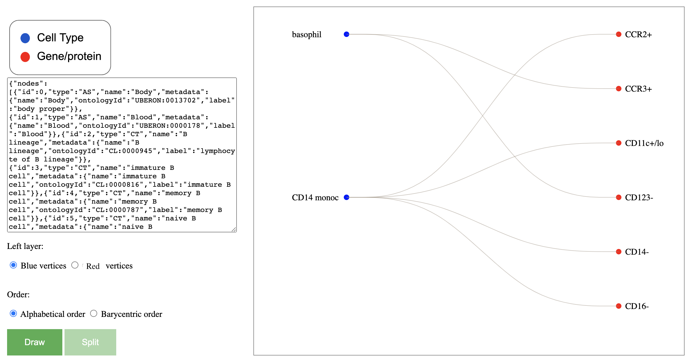
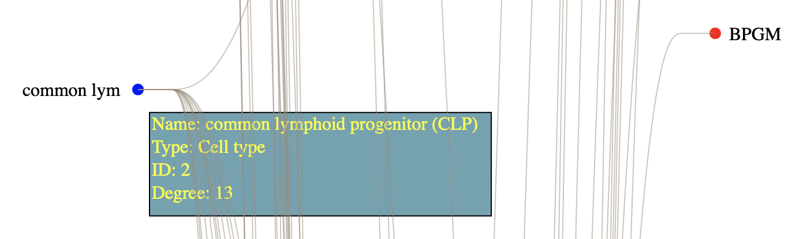

# Splitting Vertices in 2-Layer Graph Drawings

To use this software, please click on the "code" menu and then click "Download ZIP". Please extract the folder, and open the file named "index.html" in your browser. There is a textbox on the left side. You can provide input in the textbox in Json format. In the "graphs" folder there exist some Json files. You can open any of those Json files and copy the content inside the input text. Press the "Draw" button to generate a drawing.

Press the "Split" button to split some vertices and generate a crossing-free drawing. 

The right output interface is interactive; the user can see further details using different interactions. 
When the graph is large the user can scroll up and down to see different parts of the layout. 

The user can highlight the adjacent edges by clicking on a particular vertex in case of dense layouts.

We keep the label texts less than or equal to ten characters. If a label is longer then we show the first ten characters and truncate the rest. If the user puts the mouse over the label or the corresponding vertex, a pop-up message will show the full label. If the user moves out the mouse, the message will be removed too. Besides showing the full label, we also provide other useful information, e.g., the degree and ID of the vertex.

The underlying algorithm is described in [this paper](https://arxiv.org/pdf/2301.10872.pdf).
